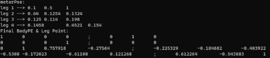

Git Test:
hello, this is a push from windows 223.10.27
hello, this is a push from Linux kaanh2, 2023.10.27 17:24
wakaka!!!

# <2023>

## E4->10.30:
* Add a function of 12 motors drive separately ; MotorTest12() ;
* Modify the function createControllerROSMotorTest() for adapting to the motor number ; and also other basic settings in the function ;
* output the final Body PE & Leg Point using FwdKin of Matrix_28 ;
* test them successfully with virtual motor ;

