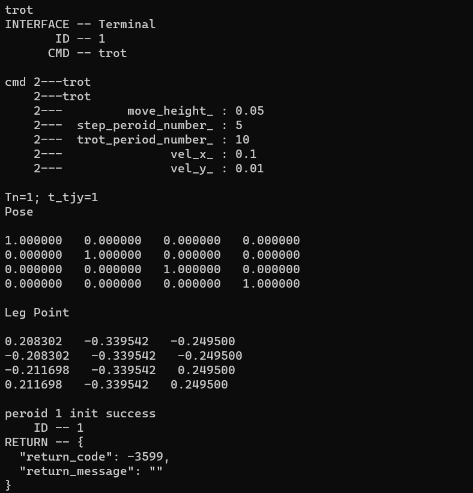

# <2023>
## Git Test:
* hello, this is a push from windows 223.10.27
* hello, this is a push from Linux kaanh2, 2023.10.27 17:24
* wakaka!!!

## E4->10.30:
* Add a function of 12 motors drive separately ; MotorTest12() ;
* Modify the function createControllerROSMotorTest() for adapting to the motor number ; and also other basic settings in the function ;
* output the final Body PE & Leg Point using FwdKin of Matrix_28 ;
* test them successfully with virtual motor;

## E5->11.7:
* Add a function for ellipse trajectory move for 4 legs; without gait planning;

## E6 ->11.10
* Use modified aris of function "Show" to show motor pos successfuly.
* Modified e4 and build success.

## E7 ->11.10
* USe std::vector to rebuild the whole ellipse plan function named EllipseTrajectory5; 
* Set a class use template named Matrix to directly modify 28D matrix startModelPE(4, 7) and centerPoint(4, 3);
* Use parameter list to transfer value in constructor function which improves efficiency;
* Plan it with mindmap first and finally  built successfully  with long time debug~

## E8 ->11.10
* A  new class to run  4-leg ellipse curve -> Ellipse4LegDrive2();
* Build successfully at 1:20 AM;

## E9 ->11.12
* A new function ReadInfoemation to play a part of Show(sh) in aris;
* But it has a much more easy to read format;
* Tested many times they have the same fun in REAL motor; in virtual motor, Mmodel Pos has a little problem;

## E10 ->11.13
* A new class to run  4-leg ellipse curve -> Ellipse4LegDrive3();
* And its corresponding Ellipse plan EllipseTrajectory7;
* Use std::vector<>  to arrange all the matrixs; index by cols * i + j;
* Correct a big mistaken: Ellipse plan, theta_ should start from pi; not 0;
* Built successfully at 23:40;

## E11 ->11.18
* Run quadruped ellipse curve success;
* command "zero" to set the motors to the position of initial model;
* command "t" to run single motors seperately;
* command "tt" to drive all  motors together that the robot's 4-Leg bent at the same time;
* all the command runs success but a little wired;

## E12 ->11.20
* Rewrite functions of Ellipse plan by simple array instead of std::vector

## E13 ->11.28
* Change PDO for new robot and test successfully.[phy_id is carefully tuned cas the messy wiring; motor 1-3's output EtherCat is useless so has to carefully rewire them and change the phy_id together ]
* Change the model's parameter with the reference of Design craft.

## E14 ->11.29
* Initially organize all the functions, keep only tested and needed funcs;

## E15 ->12.4
* Add Trot Move function;

## E16 ->12.6
* Finish Trot move function and build and run success but could not realize continous movement;
* Rewrite the function to show matrix;
* Fix the bug that couldn't use functions in operator.h; solution is change Cmake;
* Write some small module functions in operator.h;

## E17 ->12.7
* 1st edition of trot gait; includes 3 stages: trot_start, trot, stepping;

* Build successfully but run failed and debug for a long time also not fixed;

* So finally give up and rewrite it;

* The picture below shows the final operation of the program;

## E18 ->12.7
* Delete all the funxtion that won't be used;
* Completely adjusted the specification of code writing, including architecture, definition, annotation, and the use of punctuation marks;
 

## E19->12.10
* Rewrite trot plan func; failed to run; only build success;